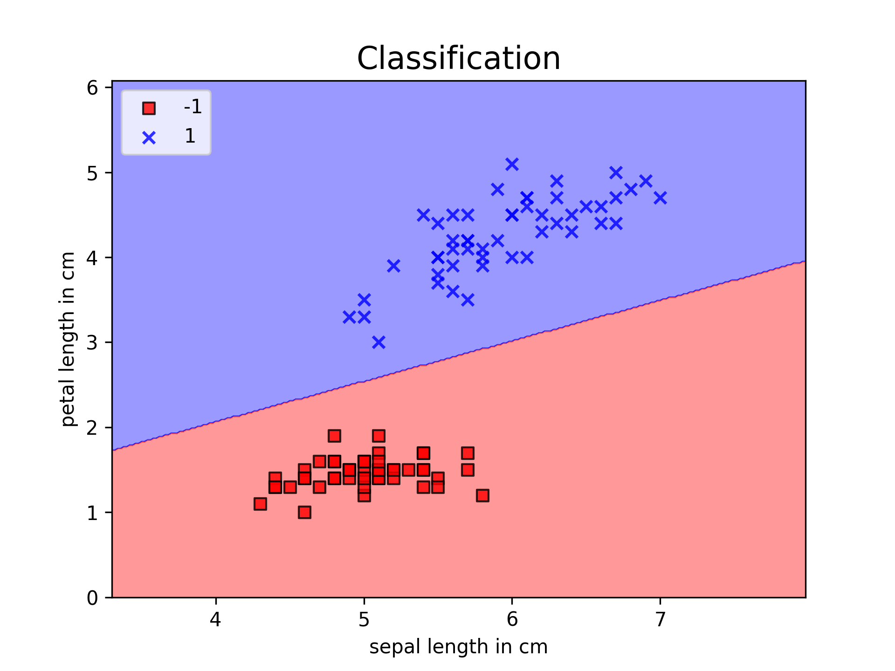

# Rosenblatts perceptron

Naive implementation of [Frank Rosenblatt's perceptron](https://en.wikipedia.org/wiki/Perceptron).

[Iris flower data set](https://en.wikipedia.org/wiki/Iris_flower_data_set) is used as the training data.

The plotted information about Setosa and Versicolor flower's petal and sepal lengths:

The model is stable after 2 training iterations:

Illustrated perceptron's decision regions

## Requirements
---
You need Python **3.6** or later to run this application.

## How to run
---
Execute mentioned below commands:

    $ git clone https://github.com/MannanSimo/rosenblatts_perceptron
    $ cd rosenblatts_perceptron
    $ python3 main.py
